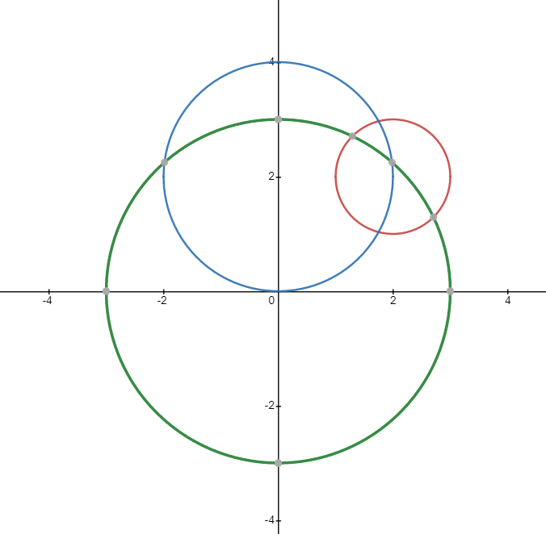

# Overview

- `README.md` : This file
- `DarrickRossHW3.py` : Main Driver file
- `gaulegf.py` : Python program to integrate using Gauss Legendre method.
- `trapezoide.py` : Python program to integrate using Trapezoidal.
- `output.txt` : Sample output of Driver.

# Part 1 Error of Integration
The goal of this assignment was to compare different integration methods of
`sin(x)` from `0` to `1`.

Using the exact solution:  
  `-cos(1.0)+cos(0.0)` is equal to `1.0-cos(1.0)`

Using this exact solution to get the error in the different integration methods.

## Part 1a Trapezoidal Method
Use points
- 16
- 32
- 64
- 128

## Part 1b Gauss Legendre Method
Use points
- 8
- 16

# Part 2 Calculate Area
Based on the following 3 circles
1. Circle 1 center at (2,2) radius 1: `(x-2)^2+(y-2)^2=1^2`
2. Circle 2 center at (0,2) radius 2: `x^2+(y-2)^2=2^2`
3. Circle 3 center at (0,0) radius 3: `x^2+y^2=3^2`

Find the area that is outside Circle 1, and inside both Circle 2 and Circle 3
